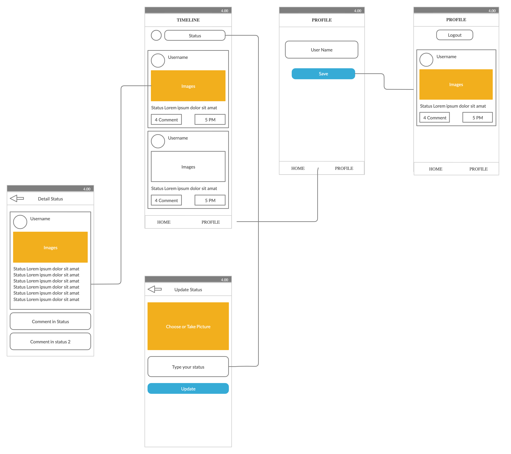

# Workshop-jkt

## Practice 1

#####  1. Create react native app using
```js
react-native init “projectname” --version --version 0.59.0
```

##### 2. Create your first Hello World in App.js using class component
##### 3. Create three class in three different file then call it on App.js
##### 4. Try styling using Stylesheet from react-native
##### 5. Try call images from Url

---------

## Practice 2

### Build your own Social media or forum

#### - The UI and flow



```js
1. Timeline Page
2. Profile Page
3. Update Status Page
4. Detail Status Page
5. Login Page
```

#### - Navigating
We will use React Navigation to create flow of app and moving between screen 

https://reactnavigation.org/

#### - Slicing / Styling
You can use Native Base UI Framweork for speed of development

https://nativebase.io/

#### - Boilerplate
Or clone this boilerplate
https://github.com/dotdidik/workshop-rn-boilerplate

#### - Backend
https://posting.baggrek.com/mobile/doc/v1
